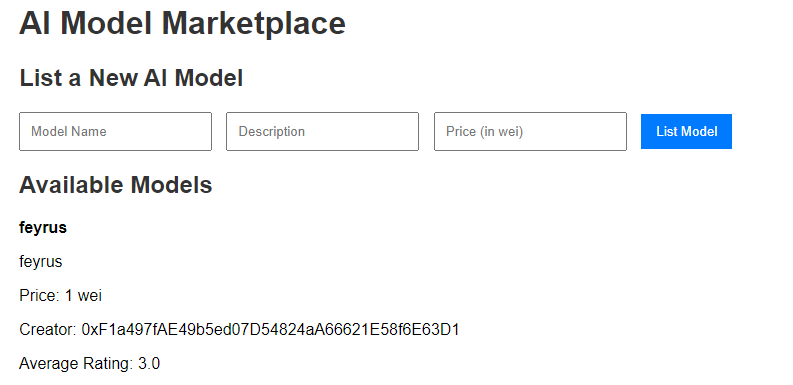
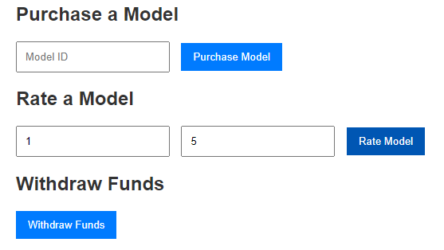

# AI Model Marketplace dApp

This decentralized application (dApp) allows users to list, purchase, and rate AI models. The marketplace is built using Ethereum smart contracts, allowing for secure and decentralized transactions between users and model creators.

## Features

- **List Models**: Users can list new AI models on the marketplace by providing a name, description, and price.
- **Purchase Models**: Users can buy listed models with Ether and support model creators.
- **Rate Models**: After purchasing a model, users can rate it, contributing to the model's overall rating score.
- **Withdraw Funds**: Model creators can withdraw earnings from the sales of their models.

## Demo Screenshots




## Usage

1. Clone this repository:
    ```bash
    git clone https://github.com/danifeyrus/AIModelMarketplace.git
    cd AIModelMarketplace
    ```

2. Open the `index.html` file in a browser.

3. Ensure MetaMask is installed and connected to the correct Ethereum network (Ganache for local testing or a public testnet).

4. Interact with the smart contract by listing, purchasing, or rating models.

## Examples

- **List a Model**:
    1. Open the dApp.
    2. Fill in the form with the model’s name, description, and price.
    3. Click the "List Model" button to add it to the marketplace.

- **Purchase a Model**:
    1. Enter the model ID you want to buy.
    2. Click the "Purchase Model" button to complete the transaction.

## License

This project is licensed under the MIT License - see the LICENSE file for details.

